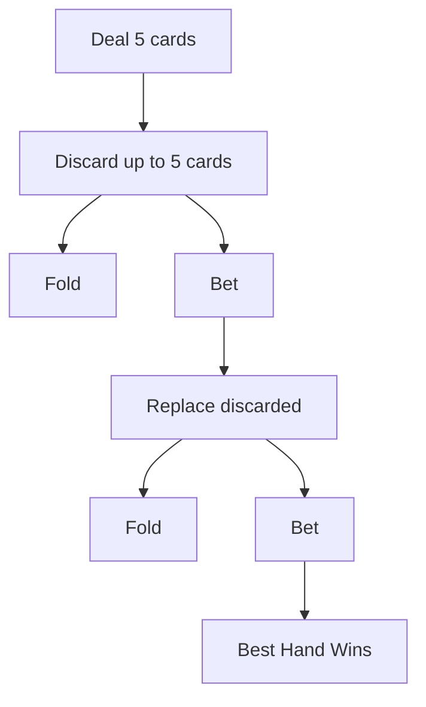
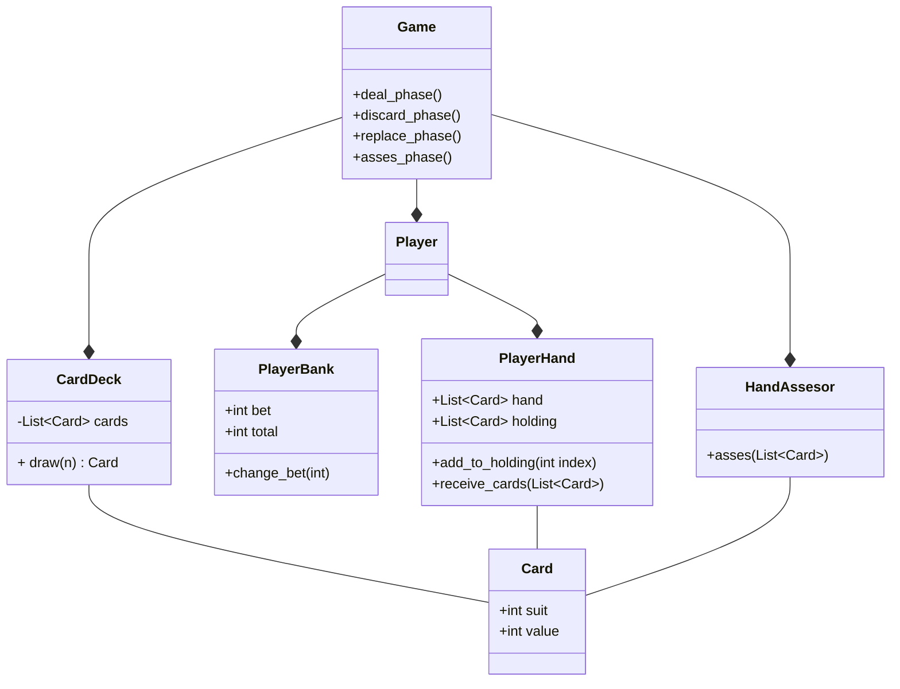
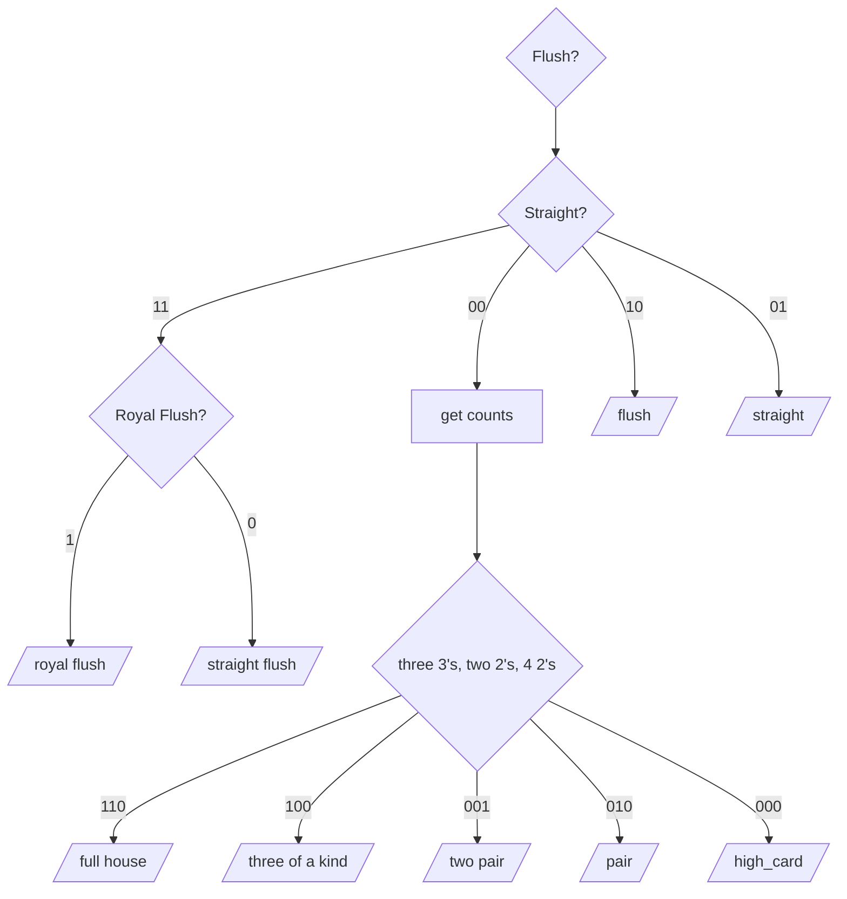

Royal Flush - 10 J Q K A of same suit

Straight Flush - 5 cards of the same suit

Four of a kind - 4 cards of the same value

Full house - 2 cards of the same value, and 3 of a different but same value

Three of a kind - 3 cards of the same value

Two pair - 2, 2 pairs

pair - two cards of the same value

pocket poker

Straight - 20
3 of a kind - 15
2 pair - 10
jacks or better - 5

striaght flush - 250
4 of a kind - 125
full house - 40
flush - 25

to play costs 5 points